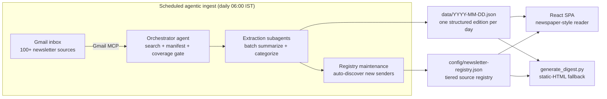

# The Daily Digest

**An agentic pipeline that turns a 100+-source newsletter inbox into a categorized daily brief every morning — read in a newspaper-style single-page app.**

Every morning at 06:00 IST, a scheduled agent reads the previous day's newsletters out of Gmail, extracts and summarizes each one, classifies it into one of eight categories, and writes a structured JSON "edition". A React single-page app renders those editions as a daily newspaper: a lead story, time-of-day sections, source tooltips, a coverage grid, bookmarks, and cross-archive search. It has run in daily production since late February 2026 — including one morning when it repaired itself before anyone knew it had failed.

> **Everything in `data/` and `config/` here is invented demo content** — fictional newsletters, fictional companies, fictional numbers — so you can run the app and judge the engineering without anyone's real inbox being published. Any resemblance between a demo source name and a real publication is coincidental. See [What's not in this repo](#whats-not-in-this-repo).

| Light | Dark |
|---|---|
|  |  |

*Source coverage view — a 14-day arrival grid across every tracked newsletter:*


## Run the demo

No install, no build step. Python (standard library only) serves the files and runs the fallback renderer; the SPA loads pinned React/ReactDOM/Babel and Google Fonts from public CDNs, so the demo needs network access.

```bash
git clone <this-repo>
cd daily-newsletter-digest
python3 -m http.server 8000
# open http://localhost:8000
```

You'll get two demo editions (Jul 21–22, 2026) over a 13-source demo registry. Try the Main/Curious tabs, star a card, filter by category or time of day, open **Sources & Coverage**, and search across editions.

The static-HTML fallback renderer also runs standalone:

```bash
python3 generate_digest.py data/2026-07-22.json
# → summaries/daily-newsletter-summary-2026-07-22.html (self-contained, emailable)
```

## The system in numbers

Aggregate counts from the live production pipeline (as of Jul 23, 2026). Only these totals are published — the underlying data stays private.

| Metric | Value |
|---|---|
| In daily production since | late February 2026 |
| Consecutive daily editions, current 90-day retention window | **90 of 90 — zero missed days** (Apr 24 – Jul 22, 2026) |
| Newsletters processed in those 90 days | **2,507** (≈28/day; busiest day 40, quietest 16) |
| Active sources in the live registry | **117**, across 5 cadence tiers |
| Registry revisions | 38 (v1.0 → v1.38), largely by the pipeline's own registry-maintenance step |
| Senders excluded as noise | 33 (promos, transactional, low-signal) |
| Content categories | 8 (+ uncategorized), markets/investing and AI/tech lead the mix |
| Parallel extraction subagents per run | 7–11, batch-partitioned by the coverage gate |
| Card shapes in the data contract | 3 — single · hybrid-C roundup · flavor-1 digest |
| Daily outputs | 2 — the SPA's JSON edition + a self-contained fallback HTML |
| Code in this repo | ≈2,600 lines (Python renderer + 4 JSX components + CSS) |

### Learned the hard way

Every self-check in this pipeline is the scar of a real production failure. Three failures, three permanent fixes:

**1 · Mornings that never ran.** In the first weeks, two days produced no digest at all and had to be reconstructed by hand, late.

**→ Built in response:** a continuity gate that opens every run — verify *yesterday* fully shipped (data file present, rendered page present, run logged) and backfill any gap before touching today's edition.

**2 · A silently dropped newsletter.** One morning, the batch split handed to the parallel extraction subagents omitted one arriving email; the end-of-run checklist caught it moments before assembly.

**→ Built in response, the very next day:** the coverage check moved *in front of* the work — extraction refuses to start until every arrived message-ID is provably assigned to exactly one batch. The end-of-run checklist stayed as a second net.

**3 · Summaries that quietly degrade.** Some emails fight extraction — oversized bodies that break a single fetch, hollow text, paywalled previews — and the dangerous failure mode is a thin summary that *looks* fine.

**→ Built in response:** oversized bodies are re-read in bounded slices; hollow text falls back to an alternate extraction path; and every run counts "snippet-only fallbacks" with a target of zero — genuinely thin sources ship as honestly-thin cards that say so.

> [!IMPORTANT]
> **Automated validation, proven in production.** Weeks after fix #1 shipped, a scheduled run genuinely failed to fire — no alert, no human noticing. The next morning's gate found the hole, **rebuilt the missing day from the inbox, and wrote a log entry about its own repair**; the humans learned of the failure afterwards, by reading that entry. That unwitnessed morning is what the 90-for-90 record above actually measures — not luck, but automated checkpoints doing their job when no one is watching.

## Architecture



**Stack:** Python · Gmail MCP · LLM APIs · React · agentic coding CLIs.

The system is two loosely-coupled halves with a JSON contract between them:

**1. Ingest — a scheduled agentic pipeline.** A daily scheduled task (Claude agent with Gmail access via [MCP](https://modelcontextprotocol.io)) runs a 10-step prompt-defined pipeline: search the inbox window, build a manifest of every newsletter that arrived, verify batch coverage against the manifest *before* extraction (a gate that catches silently-dropped emails), fan the batches out to extraction subagents that summarize and categorize each newsletter, then write the day's JSON edition and update the source registry — including auto-discovering new senders and flagging them for triage. The pipeline's prompt, schedules and account specifics are private; this repo documents the shape and ships the renderer.

**2. Reading — a zero-build React SPA.** `index.html` + four JSX components (Babel standalone, no bundler) fetch `data/index.json`, the per-day editions, and the registry. Everything is static files — any HTTP server works, there is no backend. Reading state (theme, font, read marks, bookmarks, active tab) persists in `localStorage`.

### Why 06:00 IST — and what's yours to change

The time slot is arrival logic, not habit. Each edition summarizes a complete **UTC day**, and UTC midnight falls at **05:30 IST** — so a 06:00 IST run fires minutes after the day it covers has ended everywhere on Earth. That one choice means a single daily run catches the overnight US-evening newsletters *and* has the brief on the breakfast table; the reader's morning/afternoon/evening/late-night sections come straight from each item's `arrival_ist`.

The schedule itself is just "run this agent daily at 06:00" on a scheduled-agent platform — nothing in this code knows or cares about the hour. Adapting the system for yourself means changing three things, none of them code: the schedule slot, the source registry, and the category list. And because the two halves meet only at the JSON contract, the reading side doesn't even require the agentic ingest — any process that writes a valid edition file (even a plain Python script over an mbox export) gets the same newspaper.

### The data contract

Each edition is one JSON file:

```jsonc
{
  "date_file": "2026-07-22",
  "date_display": "Jul 22, 2026",
  "day": "Wednesday",
  "main":    [ /* items from the main mailbox */ ],
  "curious": [ /* optional second stream — a secondary mailbox whose newsletters are forwarded into the main one */ ]
}
```

Every item shares `source`, `category`, `headline`, `one_liner`, `arrival_ist` (drives the time-of-day sections) and an optional `so_what` (the "why it matters" line). Beyond that, three card shapes cover the real variety of newsletters, each with its own payload:

- **single** (default) — one newsletter, one story: carries `bullets[]`.
- **hybrid_c** — roundup newsletters: carries `top_picks[]` (headline · author · synthesis · link) plus an "also in this email" `tail[]` (headline · teaser · addendum · link). No `bullets`.
- **flavor_1** — digest newsletters where every story deserves depth: carries `stories[]` (headline · author · synthesis · link). No `bullets`.

The registry (`config/newsletter-registry.json`) tiers sources by cadence (tier 1 daily → tier 3 weekly, Substack long-reads, forwarded), records sender-match rules and per-source notes, and marks excluded senders. The SPA's **Sources & Coverage** page joins the registry against the editions to show a 14-day arrival grid per source — which is how a silently-dead subscription gets noticed.

### Design notes

The reader uses an editorial, newspaper-inspired design language (v4.0.1): Fraunces for display type, Inter for body, JetBrains Mono for annotations; a lead story with an "also today" aside; time-of-day sections (morning / afternoon / evening / late night); source chips with tier dots and hover tooltips; light/dark/auto theming. The static fallback (`generate_digest.py`) renders the same JSON as a self-contained dark-theme HTML page — no JavaScript dependencies — as the emailable/archivable artifact.

## Repository layout

```
index.html                    SPA entry (React 18 + Babel standalone, pinned CDN)
app/
  Sources.jsx                 registry flattening, tier dots, tooltips, coverage page
  Rail.jsx                    left rail: tabs, search, filters, editions, reading list
  DigestView.jsx              masthead, lead story, time-bucketed streams, cards
  App.jsx                     state, routing, data fetching, localStorage persistence
  styles-v3.css               the editorial design language
generate_digest.py            static-HTML fallback renderer + runtime index writer
config/newsletter-registry.json   DEMO registry (13 invented sources)
data/
  2026-07-21.json             DEMO edition (invented content)
  2026-07-22.json             DEMO edition (invented content)
  index.json                  list of available editions (generated)
  sources.json                registry copy for the SPA (generated)
docs/                         README screenshots (of the demo data)
```

## What's not in this repo

This is a working system publishing its code, not its data. Deliberately excluded:

- **The real newsletter registry** — a personal reading list with real sender addresses. Replaced by a 13-source invented registry with the same schema.
- **Real daily editions and rendered summaries** — they contain third-party newsletter content (copyright) and personal reading history. Replaced by two invented demo editions.
- **The ingest pipeline prompt** — the 10-step scheduled-agent prompt contains account specifics and sender rules. Its architecture is described above; the prompt itself stays private.

Nothing in this repository contains real email addresses, real newsletter senders, message IDs, or credentials. The demo registry uses reserved `.example` domains throughout.

## License

[MIT](LICENSE)
