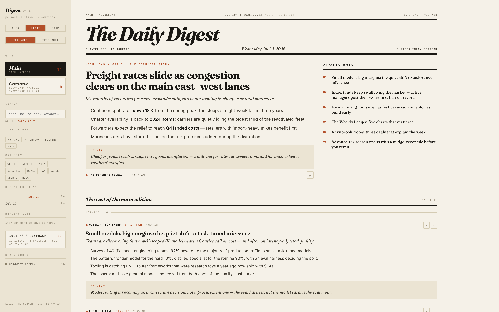
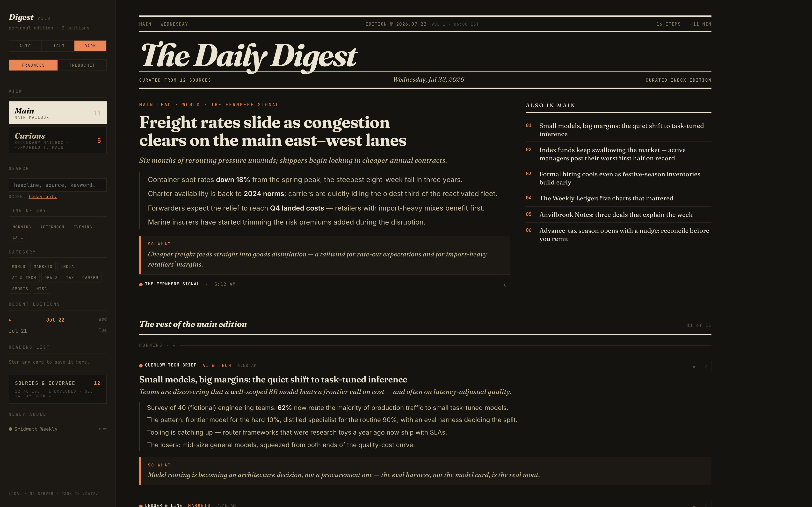
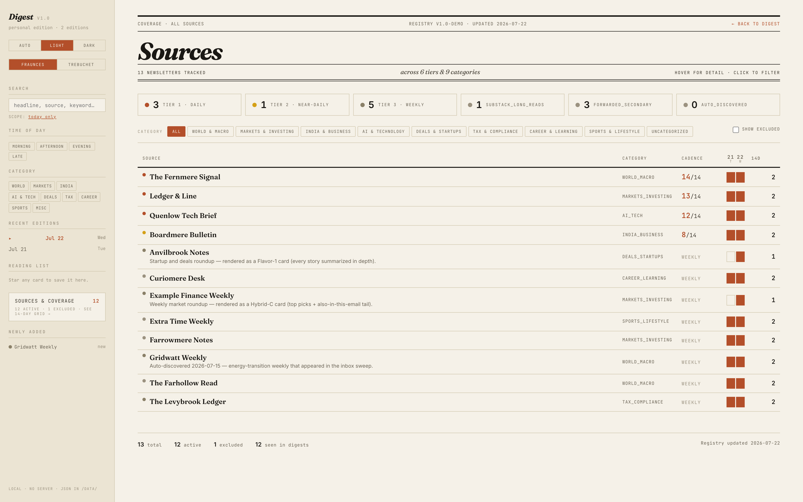
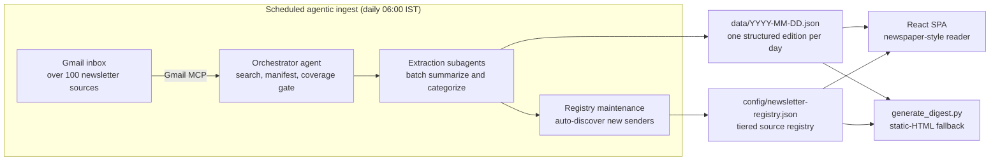

# The Daily Digest

**An agentic pipeline that turns a newsletter inbox of over 100 sources into a categorized daily brief every morning — read in a newspaper-style single-page app.**

Every morning at 06:00 IST, a scheduled agent reads the previous day's newsletters out of Gmail, extracts and summarizes each one, classifies it into one of eight categories, and writes a structured JSON "edition". A React single-page app renders those editions as a daily newspaper: a lead story, time-of-day sections, source tooltips, a coverage grid, bookmarks, and cross-archive search. It has run in daily production since late February 2026 — including one morning when it repaired itself before anyone knew it had failed.

> **Everything in `data/` and `config/` here is invented demo content** — fictional newsletters, fictional companies, fictional numbers — so the app can be run and the engineering judged without anyone's real inbox being published. Any resemblance between a demo source name and a real publication is coincidental. See [What's not in this repo](#whats-not-in-this-repo).

| Light | Dark |
|---|---|
|  |  |

*Source coverage view — a 14-day arrival grid across every tracked newsletter:*



## The system in numbers

Aggregate counts from the live production pipeline (as of Sep 1, 2026). Only these totals are published — the underlying data stays private.

| Metric | Value |
|---|---|
| In daily production since | late February 2026 |
| Consecutive daily editions on record | **131 of 131 — zero missed days** (Apr 24 – Sep 1, 2026) |
| Newsletters processed across those editions | **over 3,600** (≈28/day) |
| Active sources in the live registry | **127**, across 5 cadence tiers |
| Registry revisions | **62** (v1.0 → v1.62), largely by the pipeline's own registry-maintenance step |
| Senders excluded as noise | **45** (promos, transactional, low-signal) |
| Content categories | 8 (including uncategorized); markets/investing and AI/tech lead the mix |
| Parallel extraction subagents per run | 7–15 (typically 7–11), batch-partitioned by the coverage gate |
| Card shapes in the data contract | 3 — single · hybrid-C roundup · flavor-1 digest |
| Daily outputs | 2 — the SPA's JSON edition and a self-contained fallback HTML |
| Code in this repo | ≈4,000 lines (Python renderer, consistency gate, two runtime-evidence tools, 4 JSX components, and CSS) |

## Architecture



**Stack:** Python · Gmail MCP · LLM APIs · React · agentic coding CLIs.

The system is two loosely-coupled halves with a JSON contract between them:

**1. Ingest — a scheduled agentic pipeline.** A daily scheduled task (Claude agent with Gmail access via [MCP](https://modelcontextprotocol.io)) runs a 12-step prompt-defined pipeline (stepped through below): search the inbox window, build a manifest of every newsletter that arrived, verify batch coverage against the manifest *before* extraction (a gate that catches silently-dropped emails), fan the batches out to extraction subagents that summarize and categorize each newsletter, then write the day's JSON edition and update the source registry — including auto-discovering new senders and flagging them for triage. The registry is the single **source of truth**; each run carries a fast in-line *cache* of it for classification and, on any conflict, reconciles against the registry (source-of-truth-wins) — with a consistency gate ([`validate.py`](validate.py)) that catches any drift between the two. The pipeline's prompt, schedules and account specifics are private; this repo documents the shape and ships the renderer.

**2. Reading — a zero-build React SPA.** `index.html` and four JSX components (Babel standalone, no bundler) fetch `data/index.json`, the per-day editions, and the registry. Everything is static files — any HTTP server works, there is no backend. Reading state (theme, font, read marks, bookmarks, active tab) persists in `localStorage`.

## How a daily run works — 12 steps, 8 real checkpoints

The daily agentic run is one continuous execution but has clear phase boundaries. Compute concentrates on three areas that require judgment: search and reconciliation, extraction, and review. Everything else is Python without an LLM.

| # | Step | What happens | Executed by |
|---|---|---|---|
| 0 | Continuity gate | Verify yesterday shipped (data file, rendered page, logged run); backfill any gap before touching today | Python (no LLM) |
| 1 | Date computation | Resolve the target UTC window and display date | Python (no LLM) |
| 2 | Gmail search | Two label-scoped queries → raw thread manifest (~30-50 threads per day) | Mid-tier model, very high reasoning |
| 3 | Sender reconciliation | Match each thread against the source registry → classify Matched / Excluded / Unknown | Mid-tier model, very high reasoning |
| 4 | Extraction | Fan out to 7–15 (typically 7–11) parallel subagents; each fetches its emails' full bodies, parses MIME parts, and produces structured cards (headline, bullets, category, `so_what`). Consolidate multi-brief senders (e.g. Curiomere Desk 3→1), every subagent on the executor's own model and reasoning effort — mixed-model fan-out is a gate failure, not a preference | Mid-tier model, very high reasoning |
| 5 | Assembly | Assemble cards → `data/YYYY-MM-DD.json` | Python (no LLM) |
| 6 | Validation | Schema, timestamps, message-ID coverage, no duplicates; **worker-purity gate** — the run's own transcript is read to prove every extraction subagent ran on the executor's model and effort (`tools/worker_purity_check.py`) | Python (no LLM) |
| 7 | Render | `generate_digest.py` produces the static fallback HTML, then refreshes the SPA index and sources feed | Python (no LLM) |
| 7.5 | Dual-reviewer gate | Two independent reviewers apply a 7-item checklist (coverage, markup, bullet counts, headline style, categories, snippet honesty, consolidation math). Both must approve; any disagreement is fixed and reviewed again | High-tier model × 2 (independent reviewers), high reasoning |
| 8 | Post-review verify | Re-check schema and counts after any remediation | Python (no LLM) |
| 9 | Registry maintenance | Flag Unknown senders for the next registry sync; refresh registry mirror | Python (no LLM) |
| 10 | Cleanup | Delete manifest files older than 7 days | Python (no LLM) |
| 11 | Log append | Session entry with cards shipped, exclusions, decisions, review outcome | Python (no LLM) |

**The eight real checkpoints** (points where the run can pause for verification) sit at end-of-Step-0 (continuity), end-of-Step-2 (search complete), end-of-Step-3 (reconciliation complete), end-of-Step-4 (extraction complete), end-of-Step-5 (JSON assembled), end-of-Step-6 (validation pass), end-of-Step-7.5 (dual-review outcome), and end-of-Step-8 (post-review re-verify). Everything else is setup or post-ship housekeeping.

**Where the compute goes:**

- **Step 4 (extraction) is the single largest cost.** For each email, the reasoning model reads the full body, walks the MIME structure, and produces a card with headline, bullets, category, and a `so_what` line where relevant. Multiplied across ~30-40 matched emails per day, fanned out to 7–15 (typically 7–11) parallel subagents, this is the bulk of the run's model tokens.
- **Step 7.5 (dual-review) is the second cost center.** Two independent reviewers each apply the same 7-item checklist to the assembled digest. Running two reviewers costs more than one on purpose. It's how errors (an incorrect category, wrong bullet count, or source name left in a headline) get caught before shipping.
- **Steps 2-3 (search and reconciliation) come third.** Modest but real judgment: classifying an unknown sender, resolving a registry conflict, deciding what belongs in the manifest.
- **Coordinator overhead** — the reasoning model's own turns as it orchestrates the pipeline end-to-end. Small but not zero.
- **Everything else (Steps 0, 1, 5, 6, 7, 8, 9, 10, 11) is Python without an LLM.** Sub-second each; nine of the twelve numbered steps run without a model at all.

Mechanical work (dates, schema checks, file writes, cleanup) runs as pure code because computing a date doesn't need reasoning. Judgment work gets high reasoning effort and independent cross-review because that's where a card can be wrong.

## Learned the hard way

Every self-check in this pipeline is the scar of a real production failure. Five failures, five permanent fixes:

**1 · Mornings that never ran.** In the first weeks, two days produced no digest at all and had to be reconstructed by hand, late.

**→ Built in response:** a continuity gate that opens every run — verify *yesterday* fully shipped (data file present, rendered page present, run logged) and backfill any gap before touching today's edition.

**2 · A silently dropped newsletter.** One morning, the batch split handed to the parallel extraction subagents omitted one arriving email; the end-of-run checklist caught it moments before assembly.

**→ Built in response, the very next day:** the coverage check moved *in front of* the work — extraction refuses to start until every arrived message-ID is provably assigned to exactly one batch. The end-of-run checklist stayed as a second net.

**3 · Summaries that quietly degrade.** Some emails fight extraction — oversized bodies that break a single fetch, hollow text, paywalled previews — and the dangerous failure mode is a thin summary that *looks* fine.

**→ Built in response:** oversized bodies are re-read in bounded slices; hollow text falls back to an alternate extraction path; and every run counts "snippet-only fallbacks" with a target of zero — genuinely thin sources ship as honestly-thin cards that say so.

**4 · A cache that drifted from its source of truth.** For speed, each run classifies senders from a fast in-line copy of the source registry rather than re-reading the whole registry every time. Over months of the pipeline's own auto-maintenance, that copy fell behind the registry it mirrors — and one morning a *mis-categorized* card went out in the edition; the run's registry cross-check flagged it only after assembly. The failure was one of *correctness*, invisible to the uptime record: the edition still shipped on time, it was just subtly wrong.

**→ Built in response:** the in-line copy is now a verified **complete mirror** of the registry, guarded by three things — a **consistency gate** that fails on any category- or section-mismatch between the copy and the registry (it ships in this repo as [`validate.py`](validate.py) — run it against the demo data), a **source-of-truth-wins precedence rule** (on any conflict or unknown, the run re-checks the registry and the registry always wins), and **idempotency guards** so a lagging copy can never trigger duplicate bookkeeping. Each fix was confirmed by independent adversarial review before it shipped.

**5 · A worker on the wrong model.** During a controlled comparison of runtimes, an executor on the strongest model quietly delegated part of the extraction to a smaller sibling model. Nothing in the output said so; the written rule ("subagents run on the executor's model") had simply been ignored.

**→ Built in response:** a hard gate that reads the run's own transcript, not its claims — every extraction subagent's launch record is matched to the executor's model and effort, and the run refuses to render on a mismatch. A companion cost tool bills the run from the same transcript window (executor plus every identifiable launch that produced a billable usage record, one lookup per edition; anything it cannot bill leaves the result marked INCOMPLETE rather than silently short). Both tools are in this repo under `tools/`; on their first production day they verified 29 subagents across two editions with zero mismatches.

> [!IMPORTANT]
> **Automated validation, proven in production.** Weeks after fix #1 shipped, a scheduled run genuinely failed to fire — no alert, no human noticing. The next morning's gate found the hole, **rebuilt the missing day from the inbox, and wrote a log entry about its own repair**; the humans learned of the failure afterwards, by reading that entry. That unwitnessed morning is what the unbroken record above actually measures — not luck, but automated checkpoints doing their job when no one is watching.

## Run the demo

No install, no build step. Python (standard library only) serves the files and runs the fallback renderer; the SPA loads pinned React/ReactDOM/Babel and Google Fonts from public CDNs, so the demo needs network access.

```bash
git clone <this-repo>
cd daily-newsletter-digest
python3 -m http.server 8000
# open http://localhost:8000
```

This serves two demo editions (Jul 21–22, 2026) over a 13-source demo registry. The Main/Curious tabs, card starring, category and time-of-day filters, **Sources & Coverage**, and cross-edition search are all live in the demo.

The static-HTML fallback renderer also runs standalone:

```bash
python3 generate_digest.py data/2026-07-22.json
# → summaries/daily-newsletter-summary-2026-07-22.html (self-contained, emailable)
```

And the consistency gate from *Learned the hard way* runs on the demo data:

```bash
python3 validate.py
# → checks the registry against every edition; exit 0 = all gates pass
```

## Why 06:00 IST — and what is there to change

The time slot is arrival logic, not habit. Each edition summarizes a complete **UTC day**, and UTC midnight falls at **05:30 IST** — so a 06:00 IST run fires minutes after the day it covers has ended everywhere on Earth. That one choice means a single daily run catches the overnight US-evening newsletters *and* has the brief on the breakfast table; the reader's morning/afternoon/evening/late-night sections come straight from each item's `arrival_ist`.

The schedule itself is just "run this agent daily at 06:00" on a scheduled-agent platform — nothing in this code knows or cares about the hour. Adapting the system to another inbox means changing three things, none of them code: the schedule slot, the source registry, and the category list. And because the two halves meet only at the JSON contract, the reading side doesn't even require the agentic ingest — any process that writes a valid edition file (even a plain Python script over an mbox export) gets the same newspaper.

## The data contract

Each edition is one JSON file:

```jsonc
{
  "date_file": "2026-07-22",
  "date_display": "Jul 22, 2026",
  "day": "Wednesday",
  "main":    [ /* items from the main mailbox */ ],
  "curious": [ /* optional second stream — a secondary mailbox whose newsletters are forwarded into the main one */ ]
}
```

Every item shares `source`, `category`, `headline`, `one_liner`, `arrival_ist` (drives the time-of-day sections) and an optional `so_what` (the "why it matters" line). Beyond that, three card shapes cover the real variety of newsletters, each with its own payload:

- **single** (default) — one newsletter, one story: carries `bullets[]`.
- **hybrid_c** — roundup newsletters: carries `top_picks[]` (headline · author · synthesis · link) and an "also in this email" `tail[]` (headline · teaser · addendum · link). No `bullets`.
- **flavor_1** — digest newsletters where every story deserves depth: carries `stories[]` (headline · author · synthesis · link). No `bullets`.

The registry (`config/newsletter-registry.json`) tiers sources by cadence (tier 1 daily → tier 3 weekly, Substack long-reads, forwarded), records sender-match rules and per-source notes, and marks excluded senders. The SPA's **Sources & Coverage** page joins the registry against the editions to show a 14-day arrival grid per source — which is how a silently-dead subscription gets noticed.

## Design notes

The reader uses an editorial, newspaper-inspired design language (v4.0.1): Fraunces for display type, Inter for body, JetBrains Mono for annotations; a lead story with an "also today" aside; time-of-day sections (morning / afternoon / evening / late night); source chips with tier dots and hover tooltips; light/dark/auto theming. The static fallback (`generate_digest.py`) renders the same JSON as a self-contained dark-theme HTML page — no JavaScript dependencies — as the emailable/archivable artifact.

## Runtime evidence tools

A pipeline that claims a property should prove it. The two tools in `tools/` read the session transcripts the agentic command-line interface (CLI) writes. These are the JSON Lines (JSONL) files of Claude Code and Codex. The tools never trust what the run says about itself.

**Finding the run.** The executor prints a run token, `DIGEST-RUN-YYYY-MM-DD-HHMM`, as its own reply line. After whitespace, backticks and asterisks are stripped, the line must equal the token. The window opens there and closes at the next new token printed the same way in the same session. A token quoted mid-sentence, in a tool call or in a pasted review is ignored, so a later discussion never re-selects the run.

**Proving worker purity.** `worker_purity_check.py` matches every tagged extraction subagent's launch record against the executor's model and effort, then prints one machine-readable last line. `PURITY: PURE` (exit 0) means every worker matched. `PURITY: MIXED` (exit 1) names the offenders. `PURITY: NOTHING-TO-CHECK` (exit 2) means no tagged worker was found. That passes only on an edition known to have run inline with zero subagents; otherwise it blocks the pipeline until the workers finish writing. A lookup or usage error exits 3 with no `PURITY:` line, and the pipeline treats a missing line as a failure.

**Pricing the run.** `session_cost.py` bills the same window: the executor plus every identifiable launch with a usage record. Claude Code subagents are matched by the launch's recorded agent id. Codex children are billed for every task cycle started or re-driven inside the window. Rates are the published list prices per model of each application programming interface (API). Subscription plans bill differently, so the figure is a comparison, not an invoice.

Codex is priced from the per-turn deltas of the rollout's own usage events. Cache writes cost 1.25 times the input rate. Any request over 272K input carries the published long-context surcharge, in the cost only; the token columns keep the actual counts.

**Never quietly short.** Anything the cost tool cannot bill is named in a note and the result is marked `INCOMPLETE`, exit 4. That covers six cases:

- a launch with no recorded id
- a missing transcript
- a child with no valid usage record
- one unbilled task cycle of a child that billed its other cycles
- a malformed usage record
- an unknown baseline after a malformed event

Neither tool hardcodes a machine path. `DIGEST_HUB` sets the project root. `CLAUDE_PROJECTS_ROOT` moves the Claude Code transcript root. `DIGEST_CLAUDE_DIRS` (colon-separated) adds transcript folders. `CODEX_SESSIONS_DIR` moves the Codex rollout root.

```
python3 tools/worker_purity_check.py --marker DIGEST-RUN-YYYY-MM-DD-HHMM     # Claude Code
python3 tools/worker_purity_check.py --codex-run DIGEST-RUN-YYYY-MM-DD-HHMM  # Codex
python3 tools/session_cost.py --session <id> --marker <token>
```
python3 tools/worker_purity_check.py --marker DIGEST-RUN-YYYY-MM-DD-HHMM     # Claude Code
python3 tools/worker_purity_check.py --codex-run DIGEST-RUN-YYYY-MM-DD-HHMM  # Codex
python3 tools/session_cost.py --session <id> --marker <token>
```

## Repository layout

```
index.html                    SPA entry (React 18 with Babel standalone, pinned CDN)
app/
  Sources.jsx                 registry flattening, tier dots, tooltips, coverage page
  Rail.jsx                    left rail: tabs, search, filters, editions, reading list
  DigestView.jsx              masthead, lead story, time-bucketed streams, cards
  App.jsx                     state, routing, data fetching, localStorage persistence
  styles-v3.css               the editorial design language
generate_digest.py            static-HTML fallback renderer and runtime index writer
validate.py                   registry↔editions consistency gate (the drift check from "Learned the hard way")
tools/
  worker_purity_check.py      hard gate: proves every extraction subagent ran on the executor's model and effort (reads the CLI transcripts)
  session_cost.py             per-run cost and wall-clock from the same transcripts, one lookup per edition
config/newsletter-registry.json   DEMO registry (13 invented sources)
data/
  2026-07-21.json             DEMO edition (invented content)
  2026-07-22.json             DEMO edition (invented content)
  index.json                  list of available editions (generated)
  sources.json                registry copy for the SPA (generated)
docs/                         README screenshots (of the demo data)
```

## What's not in this repo

This is a working system publishing its code, not its data. Deliberately excluded:

- **The real newsletter registry** — a personal reading list with real sender addresses. Replaced by a 13-source invented registry with the same schema.
- **Real daily editions and rendered summaries** — they contain third-party newsletter content (copyright) and personal reading history. Replaced by two invented demo editions.
- **The ingest pipeline prompt** — the 12-step scheduled-agent prompt contains account specifics and sender rules. Its architecture is described above; the prompt itself stays private.

Nothing in this repository contains real email addresses, real newsletter senders, message IDs, or credentials. The demo registry uses reserved `.example` domains throughout.

## License

[MIT](LICENSE)
